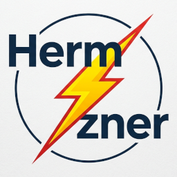

# Hermzner

Provision a hardened Hermes Agent on Hetzner with rootless Podman and Tailscale.

## Prerequisites

- [Terraform](https://developer.hashicorp.com/terraform/install) >= 1.5
- [Ansible](https://docs.ansible.com/ansible/latest/installation_guide/) >= 2.15
- [Hetzner Cloud API token](https://docs.hetzner.com/cloud/api/getting-started/generating-api-token)
- [Tailscale pre-auth key](https://tailscale.com/kb/1085/auth-keys) (reusable or ephemeral)

## Quick Start

```bash
# 1. Copy and edit Terraform variables
cp terraform/terraform.tfvars.example terraform/terraform.tfvars
vim terraform/terraform.tfvars

# 2. Copy and override Ansible defaults
vim ansible/inventory/group_vars/all.yml
# Required: set hermes_image_ref to a pinned digest
#   Resolve the latest digest:
#     curl -s "https://hub.docker.com/v2/repositories/nousresearch/hermes-agent/tags/main" | jq -r '.images[] | select(.architecture == "amd64" and .os == "linux") | .digest'
#   Then set: hermes_image_ref: 'docker.io/nousresearch/hermes-agent@sha256:<digest>'

# 3. Deploy
HCLOUD_TOKEN=your_token TAILSCALE_AUTH_KEY=tskey-auth-... ./deploy.sh
```

## Deploy Flow

`deploy.sh` runs Terraform (provisions VPS) then Ansible (configures it). Ansible connects via the server's **public IPv4** — Tailscale isn't available until the Tailscale role runs. Running `terraform plan` shows the diff between Terraform state and real infrastructure; this is normal behavior, not an error. `apply` reconciles them.

## Smoke Test Deployment

Use this procedure for a first disposable test deployment. The goal is to validate Terraform, Ansible, Tailscale access, rootless Podman, and the Hermes runtime wiring before using a pinned production image.

> **Important:** Run this only against a disposable Hetzner VPS. The smoke test may use `ALLOW_UNPINNED_IMAGE=true` for convenience. Do not use this override for production.

### 1. Prepare local variables

Create and edit the Terraform variables file:

```bash
cp terraform/terraform.tfvars.example terraform/terraform.tfvars
vim terraform/terraform.tfvars
```

## What Gets Deployed

| Component         | Detail                                                                      |
| ----------------- | --------------------------------------------------------------------------- |
| VPS               | Hetzner cx23, Ubuntu 24.04                                                  |
| Container Runtime | Rootless Podman (Quadlet default, Compose fallback)                         |
| Network           | Tailscale SSH + subnet access                                               |
| Service           | Hermes Agent (gateway, API, optional dashboard)                             |
| Mnemosyne Memory  | SQLite-vec memory backend (optional, toggle via `hermes_mnemosyne_enabled`) |
| Backups           | Daily local backups to /home/hermes/backups/; optionally encrypted with age |

## Security Controls

- Rootless container, all capabilities dropped, no-new-privileges
- All ports bound to 127.0.0.1 (access via Tailscale SSH tunnel)
- UFW default deny, only tailscale0 allowed
- Read-only root filesystem, tmpfs for /tmp and /run
- API key auto-generated, .env at 0600
- Image digest pinning required (fail-closed if missing)

See [`SECURITY.md`](./SECURITY.md) for the full security model, threat model, and design rationale.

## Post-Deployment

```bash
# Access dashboard via SSH tunnel
ssh -L 9119:127.0.0.1:9119 hermes@<tailscale-ip>

# Open http://127.0.0.1:9119 in browser
```

## Mnemosyne Memory Backend (Optional)

Mnemosyne provides persistent memory (SQLite-vec) for the Hermes Agent, enabling long-term recall across conversations.

### Enable

```yaml
# ansible/inventory/group_vars/all.yml
hermes_mnemosyne_enabled: true
```

### What Happens

When enabled, two dedicated Ansible roles handle the integration:

- **`mnemosyne_build`** — builds a custom container image extending the pinned Hermes base with `mnemosyne-memory[all]`, tags it as `localhost/hermes-mnemosyne:latest`
- **`mnemosyne_runtime`** — runs after the container starts: waits for the health endpoint, runs `mnemosyne.install` inside the container (plugin symlink + config.yaml update), and restarts the service only if changes were made

The Quadlet/Compose template uses the custom image and sets `MNEMOSYNE_DATA_DIR=/opt/data/mnemosyne` for SQLite persistence.

### Post-Deploy Setup (one-time, after `hermes_start_runtime: true`)

The runtime install is automated by Ansible. The only manual step is selecting `mnemosyne` as the active memory provider:

```bash
ssh hermes@<tailscale-ip>
podman exec -it hermes /opt/hermes/.venv/bin/hermes memory setup
# Select 'mnemosyne' from the provider list
```

Verify with `/opt/hermes/.venv/bin/hermes memory status` (inside container) — should show `Provider: mnemosyne`.

### Manual Setup (if `hermes_start_runtime: false`)

```bash
ssh root@<tailscale-ip>
sudo -u hermes XDG_RUNTIME_DIR=/run/user/$(id -u hermes) podman exec hermes python3 -m mnemosyne.install
sudo -u hermes XDG_RUNTIME_DIR=/run/user/$(id -u hermes) systemctl --user restart hermes.service
ssh hermes@<tailscale-ip>
podman exec -it hermes /opt/hermes/.venv/bin/hermes memory setup
```

Memory data lives at `/home/hermes/.hermes/mnemosyne/` and is included in daily backups.

## Backup & Restore

**Daily backups** run via cron at 2am (user `hermes`). They archive `/home/hermes/.hermes/` (data + auto-generated `.env`) to `/home/hermes/backups/` with 30-day retention. When Mnemosyne is enabled, memory data at `/home/hermes/.hermes/mnemosyne/` is included automatically.

```bash
# Backup file format (plain):
/home/hermes/backups/hermes-backup-20260521-020000.tar.gz

# Backup file format (encrypted):
/home/hermes/backups/hermes-backup-20260521-020000.tar.gz.age
```

Enable encryption by setting `backup_encryption_enabled: true` and `backup_age_recipient` (your age public key) in `group_vars/all.yml`.

**Restore** from any backup archive to a running server:

```bash
# Plain backup:
./scripts/restore.sh /path/to/hermes-backup-20260521-020000.tar.gz

# Encrypted backup (requires age private key):
./scripts/restore.sh /path/to/hermes-backup-20260521-020000.tar.gz.age --age-key ~/.age/key.txt
```

The script auto-detects the Tailscale IP (falls back to `--tailscale-ip` if Terraform state is missing), copies the archive, stops the runtime, extracts, fixes permissions, restarts, and runs `verify.yml`.

## Directory Structure

```
terraform/       # Hetzner VPS provisioning
ansible/         # Server configuration (5 roles)
  inventory/
    group_vars/        # Ansible group variables (all.yml)
deploy.sh        # One-command deploy (auto-generates hosts.yml)
teardown.sh      # Destroy everything
```

## Development Tools

### repo_check.sh

`scripts/repo_check.sh` runs local security and consistency checks against the repo. It scans for:

- Secret leakage (API keys, tokens in committed files)
- Dangerous container flags (`--privileged`, host networking, etc.)
- Image pinning and port binding enforcement
- Shell / YAML / Ansible syntax errors
- Optional Terraform validation

```bash
./scripts/repo_check.sh
```

Output is written to `hermzner-local-check-report.txt` (gitignored).

## Customization

See `ansible/inventory/group_vars/all.yml` for all configurable options, including feature toggles (`hermes_dashboard_enabled`, `hermes_mnemosyne_enabled`, `hermes_start_runtime`), resource limits, backup settings, and security policies.
